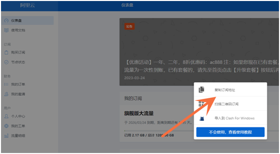
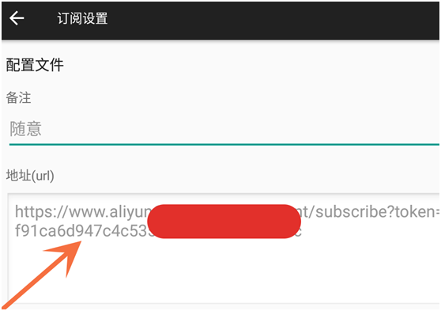

# 安卓版使用方法

## 1    下载安装 使用文档—Android使用教程—客户端下载 

​           下载后直接安装。

## 2    使用 仪表盘-— 一键订阅 — 复制订阅地址

打开刚安装好的软件 点击左三角三个杠

点击订阅设置，

​    点击右上角+号，把订阅地址粘贴进去

​    备注随便写 然后点右上角√保存。

## 3     右上角点开，更新订阅

节点出来后，测试一下网速 最后选个喜欢的节点点击右下角启动按钮。

