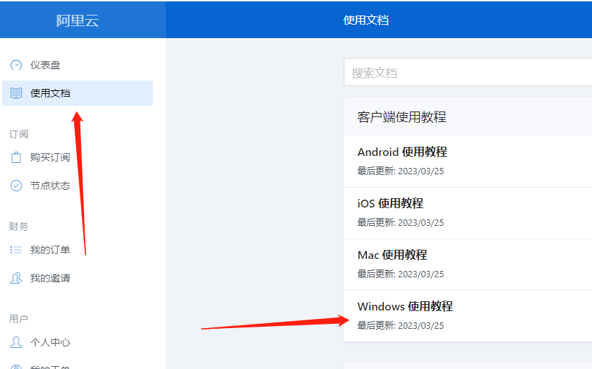

# windows版使用方法

## 1 下载安装 使用文档—windows使用教程—clash客户端下载

解压好以后双击exe文件打开

## 2 使用 仪表盘-- 一键订阅-- 导入到Clash For Windows

打开clash后配置已自动导入

## 3 点击代理 右上角测速。 随便选一个喜欢的的节点。

最后启动。**右键**点击桌面黑色小猫图标，选择系统代理 ，黑色小猫变成黄色后表示成功

